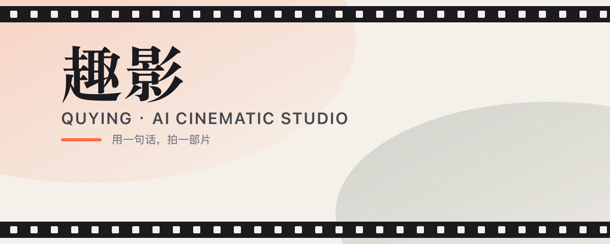

<p align="center">
  
</p>

<h1 align="center">QuYing · AI Cinematic Studio</h1>

<p align="center">
  <strong>Stories, Cinematically.</strong><br>
  An end-to-end AI tool for short-drama / comic-style video creation — script → storyboard → final cut.
</p>

<p align="center">
  <a href="README.md">中文</a>
</p>

---

## ✨ Features

- 🎬 **AI Script Analysis** — Parse novels into characters, scenes, and plot beats
- 🎨 **Character & Scene Generation** — Consistent characters and worlds across episodes
- 📽️ **Storyboard → Video** — One-click conversion from text to a finished short film
- 🎙️ **AI Voiceover** — Multi-character speech synthesis with emotional delivery
- 🌐 **Bilingual UI** — Chinese / English, switchable from the navbar

---

## 🚀 Quick Start

**Prerequisite**: [Docker Desktop](https://docs.docker.com/get-docker/)

### Option 1 · Clone & Build (Recommended)

```bash
git clone <your-repo-url> quying
cd quying
docker compose up -d --build
```

Update:
```bash
git pull
docker compose down && docker compose up -d --build
```

> ⚠️ During the beta phase, schema between versions may be incompatible. To upgrade:
> ```bash
> docker compose down -v
> docker compose up -d --build
> ```
> After restart, **clear your browser cache** and sign in again to avoid stale frontend state.

### Option 2 · Local Development

```bash
git clone <your-repo-url> quying
cd quying

cp .env.example .env
# Edit .env and fill in your AI API keys

npm install

# Boot only infra (MySQL / Redis / MinIO)
docker compose up mysql redis minio -d

# Initialise database schema (required on first run)
npx prisma db push

npm run dev
```

> [!WARNING]
> Skipping `npx prisma db push` will fail at runtime with `The table 'tasks' does not exist`.

Open [http://localhost:13000](http://localhost:13000) (Docker mode) or [http://localhost:3000](http://localhost:3000) (dev mode).

---

## 🔧 API Configuration

Sign in, open **Settings**, and paste your provider API keys. Built-in walkthroughs are included.

---

## 📦 Tech Stack

- **Framework**: Next.js 15 + React 19
- **Database**: MySQL + Prisma ORM
- **Queue**: Redis + BullMQ
- **Styling**: Tailwind CSS v4 + QuYing design system
- **Auth**: NextAuth.js

---

## 🎨 Design Language

QuYing's visual identity is "film stock · warm paper · sunset orange" — intentionally distinct from typical SaaS blue/purple palettes.

| Role | Hex |
|---|---|
| Canvas | `#F5F1EA` paper |
| Ink | `#1A1A1F` film black |
| Brand | `#FF6A3D` sunset orange |
| Secondary | `#2F4A3F` film green |

Display type: Source Han Serif (poster feel). UI type: Geist Sans.

---

**Made with ❤️ — QuYing team**
